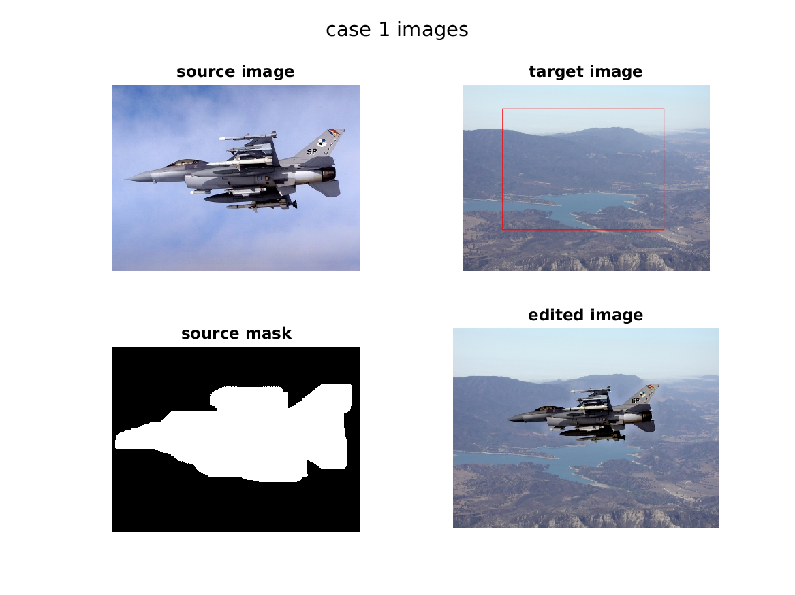

# Poisson Image Editing

Given a source image, a target image and a "mask" image to determine which pixels should blend from the source image into the target image. A simple cut and paste of the masked region gives a bad blend since the gradients of the source do not match the gradients of the target. Poisson Image Editing computes gradient for masked region on source image and then apply it on target image.The result is that each "transplanted" pixel on the target image has a gradient that is the same as the gradient of the corresponding pixel on the source image, but still have all the features of the source image.

## Examples:

  

